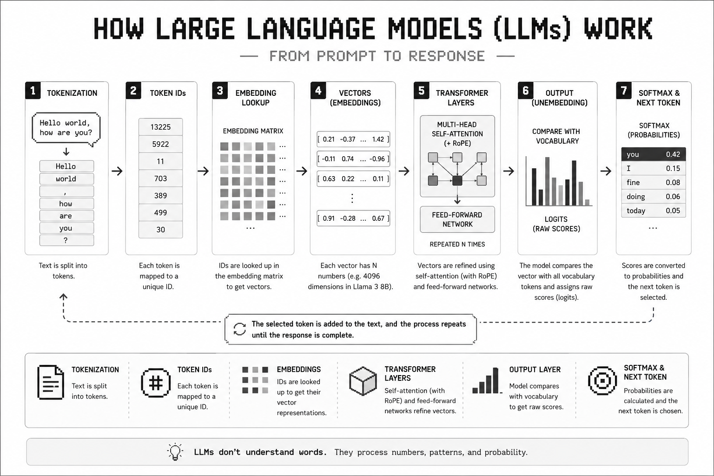

# How Large Language Models (LLMs) Work: From Prompt to Response

## Introduction
Large Language Model (LLM) is a Natural Language Processing (NLP) model trained on a massive amount of text data. It learns patterns, relationships and structures in language, allowing it to process text, answer questions, perform reasoning tasks and generate human-like text. Modern LLMs can also work with other formats such as images, audio and code, depending on how they are trained.



## Fundamental Concepts
Before diving into the technical working of LLM, let's first understand some technical terms.

### Tokens
As we all know and heard coutless times that machines don't understand words, they only understand numbers. So, text is divided into multiple words, sub-words, symbols or spaces depending on the model, then that divided part is mapped to a number (token ID). Basically token is a text unit which is mapped to a token id so machine can process it. 
For example let's say we have  "Hello world", this will be divied into  "Hello", " world" tokens and then mapped to 13225, 5922 token IDs (depending on the model). For more better understanding you can check [Tiktokenizer](https://tiktokenizer.vercel.app/), to see how different models divide text into tokens.

### Vectors (Embeddings)
A vector is a list of numbers that represents a token in a way the model can process. Similar words usually have similar vectors, allowing the model to capture semantic meaning. How many numbers a vector will have depends on the dimension, it ranges often from 4,096 to 12,288 dimensions in modern LLMs. Llama 3 8B uses 4096 dimensions, so 1 vector has 4096 numbers. 

Embedding is a specific type of vector that has been trained to capture meaning. We have Static embedding and contextual embedding. Static embedding gives a fixed vector and contextual embeddings gives a context based embedding so it changes according to context.
For example let's say we have two sentences "She ate an apple after lunch" and "He bought a new Apple laptop", both have apple, the static embedding will give a fixed vector for both but contextual embedding will give a dynamic vector.

```example
[ Human Text ] ──> 1. Token ──> 2. Token ID ──> 3. Embedding (Lookup) ──> 4. Vector
```

### Parameters
In simple words parameters are the knowledge that a model learned during training and it uses this knowledge to respond. The model like Llama-3-8B has 8 billion parameters meaning it has learned 8 billion values (weights).

## How LLM Processes your Prompt

### Tokenization
First the text (prompt) goes through tokenization, meaning it is divided into tokens and then tokens are mapped to their crossponding token ids.

### Embedding vector
Once the model had the token id, it look ups the embedding matrix to get the vector. At this stage we have the static vector of that token which represents the generic defination  that model learned during training.

### Transformer Layers
Now the static vector goes through a number of transformer layers.
*Self Attention* is the mechanism that looks at all the vectors and decides which vector are important for understanding the context. In simple words you can say self-attention is the context-calculator. The modern LLMs uses multi-head attention which basically runs multiple self-attention mechanism in parallel.
During the self attention layer, RoPE is applied, so model can keep a track of the position of token in a sequence.

The next layer is *Feed-forward network*. It treates the vector as an isolated package, it refines the internal meaning of the vector before sending it to next transformer layer.  

Next is the output layer, now at this stage your vector is  is a contextualized vector containing the entire context of your prompt. Now model makes the prediction list, it compares the vector against all the tokens in it's vocabulary and assigns a raw score.
Then softmax is used to convert this raw score into clean percentage. At last the model takes a guess, in most of the cases the model picks the one with higher percentage but in some cases it can also pick a low percentage one as well, that's what makes the model more creative.
Once the word is guessed, model merges it into the original sentence and repeats the process to guess the new word, and it goes on until the response is complete.

## Conclusion
In conclusion, your prompt first goes through tokenization where it is divided into small units called token, each token is mapped to token id. Then that token id is used to lookup the static vector from the embedings matrix. After that static vector goes through a lot of transformer layers like self-attention, feed-forward network, where the static vector becomes a highly contextualized vector, RoPE is also applied during these layers so model can keep track of vector positions in the sequence. Finally the model compares the vector with the tokens in it's vocabulary and assign raw score, softmax converts that raw score into clean percentage and finally model takes a guess and selects a word. Then that word is merged into the original sentence and the whole process repeats until the sentence is completed.
